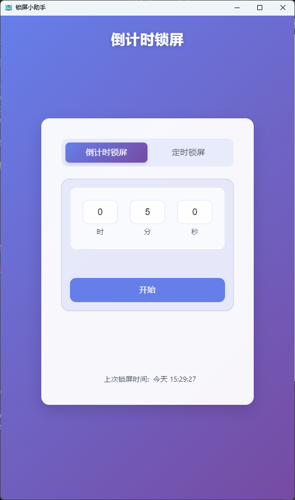
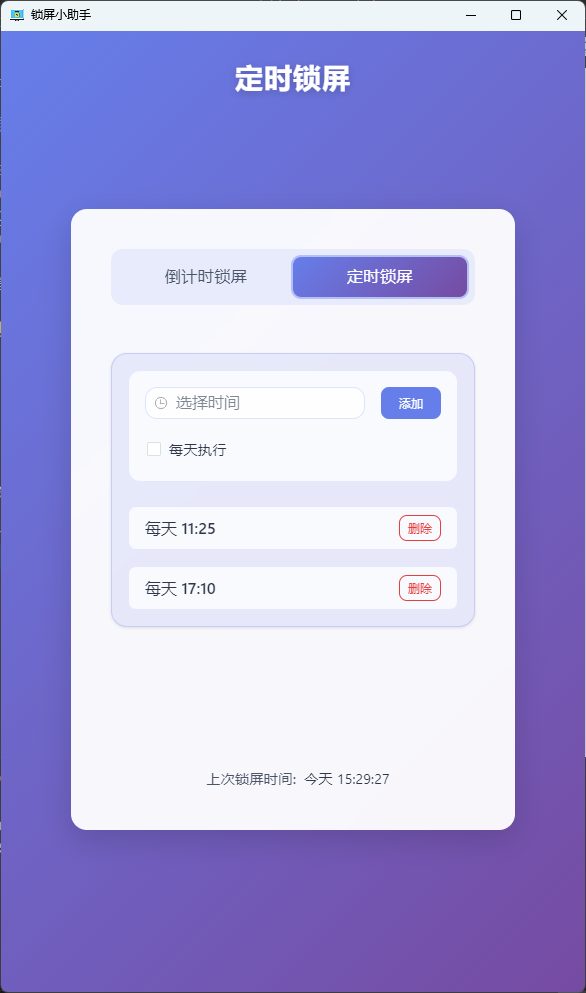
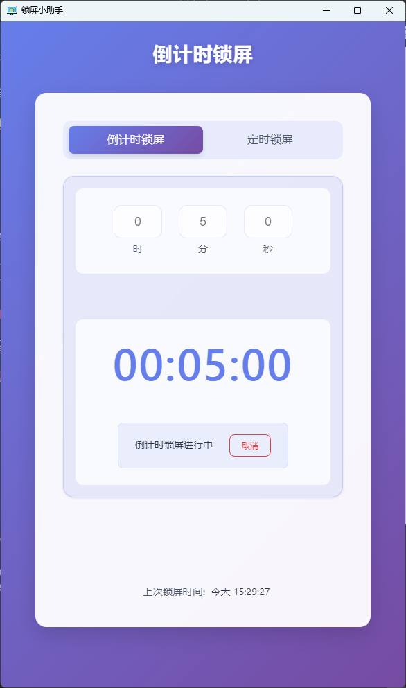
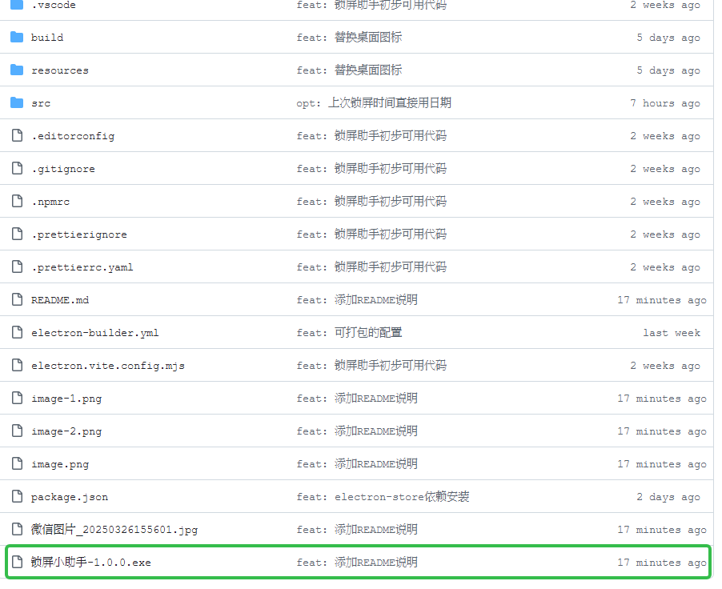

# 锁屏小助手 (Screen Lock Assistant)

一个简单易用的定时锁屏小助手，基于 Electron 和 Vue 开发。

## 🌟 功能特性

- ⏱️ 倒计时模式：自定义倒计时后锁定屏幕
- 🔄 定时锁屏：支持单次和每天的定时锁屏
- 🕒 上次锁屏时间显示：查看最近一次锁屏的时间
- 💻 平台支持：适用于 Windows

## 📸 软件截图

### 🚀 exe文件地址

## 💖 赞赏

如果您觉得这个小助手对您有帮助，欢迎赞赏支持开发者！

